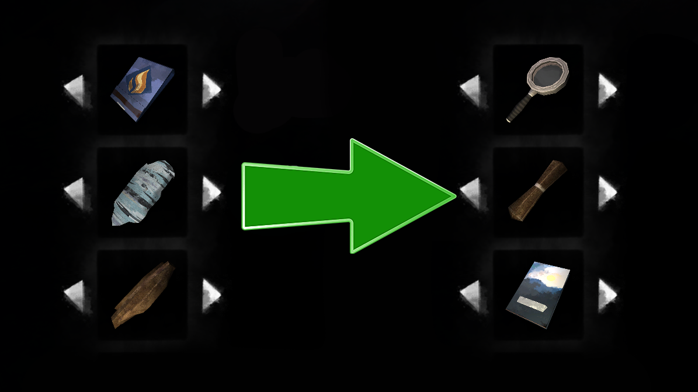

# QoL FireStart

A MelonLoader mod for **The Long Dark** survival mode.

QoL FireStart is a mod that makes fire starting process a little simpler by choosing best gear instead of ordering by name.
The UI in **The Long Dark** are notorious for being clunky. This is particularly frustrating when selecting items from a horizontal list, as scrolling through the entire inventory to find the right one becomes a hassle. The QoL FireStart mod aims to streamline the process of selecting fire-starting tools. The selection logic in the base game makes little sense; it relies on simple alphabetical sorting—specifically, sorting by localized names. Consequently, the game might suggest using reclaimed wood to one player while recommending birch bark as tinder to another. QoL FireStart addresses this by automatically selecting the optimal fire-starting option based on the current situation. I developed the underlying algorithm based on my own playthroughs on Stalker and Interloper difficulties. For example, if it's daytime and clear weather, a magnifying lens would be selected automatically. But if you also have lit torch in your hands, it's obviously better choice.

## Choice algorithm
#### Fire starters:
1. Lit torch or flare. It's free source.
2. Magnifying lens (if available). It's slower than torch but also free.
3. Firestriker.
4. Wood matches.
5. Pack matches.

#### Tinders:
1. Any unbreakable tinder.
2. Any breakable tinder like newsprint.
3. Birchbark at last.

#### Fuel:
1. Book or completed research book.
2. Stick
3. Cedar wood.
4. Firelog
5. Fir wood.
6. Reclaimed wood.
7. Torch.
8. Any uncompleted research book.

No setting for now implemented. May change if requested.

## Known Issues

* None

## Compatibility

* Compatible with Improved Magnifying Lens.
* Compatible with Fire Pack DLC.

## Installation

* Common mods installation process is described at [TLD Mods](https://tldmods.net/install.html). Make sure your MelonLoader version matches.
* Download latest mod version from Releases page.
* Drop archive files to Mods folder in The Long Dark game directory.
